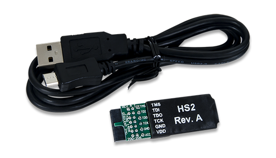

# FPGA

This folder contains everything needed to synthesize and run PULPino on a ZCU102 board revision 1.1 from xilinx.


## Requirements

This synthesis flow has been tested with `Vivado 2018.2`, there is no guarantee
that it is going to work with any other version without modifications to the
scripts.


The debugging is performed with riscv32-unknown-elf-gdb of gnu RISC-V toolchain at https://github.com/riscv/riscv-gnu-toolchain.
As a consequence, you need to install it.

In addition, you need to install OpenOCD which is used to debug, In the directory doc/risc-debug-notes/pdfs, 
the building-openocd.pdf document describes steps to build and install openocd.

The RI5CY processor has specific Xpulp extension. you need to install the RI5CY toochain at https://github.com/riscveval/ri5cy-gnu-toolchain 
to be enable to compile Xpulp extension of the RI5CY core.

At last, to program and debug pulpino, you will need to use the diligent JTAG-HS2 Programming cable with OpenOCD, 
way to install this debug adapter is described in the document  doc/risc-debug-notes/pdfs/openocd-digilent-hs2.pdf.


## Get Started

0. Type `make` in the fpga directory ( with `Vivado 2018.2`).
   This builds the FPGA bitstream for the ZCU102.

1. When the bitstream generation is achieved, connect and switch on the ZCU102 board.
   To program the FPGA, type `make program_FPGA` in the fpga directory.
    

2. Make sure the digilent JTAG-HS2 debug adapter is properly connected.
    

3. By following instruction in `sw` directory, compile helloworld application.

4. When helloworld application is compiled, launch OpenOCD by typing `openocd -f openocd_diligent_hs2.cfg`
   If it is successful,you should see something like this:

    Open On-Chip Debugger 0.10.0+dev-00832-gaec5cca (2019-12-10-14:21)
    Licensed under GNU GPL v2
    For bug reports, read
	http://openocd.org/doc/doxygen/bugs.html
    Info : auto-selecting first available session transport "jtag". To override use 'transport select <transport>'.
    Info : clock speed 1000 kHz
    Info : JTAG tap: riscv.cpu tap/device found: 0x249511c3 (mfg: 0x0e1 (Wintec Industries), part: 0x4951, ver: 0x2)
    Info : datacount=2 progbufsize=8
    Info : Examined RISC-V core; found 16 harts
    Info :  hart 0: XLEN=32, misa=0x40001104
    Info :  hart 1: currently disabled
    Info :  hart 2: currently disabled
    Info :  hart 3: currently disabled
    Info :  hart 4: currently disabled
    Info :  hart 5: currently disabled
    Info :  hart 6: currently disabled
    Info :  hart 7: currently disabled
    Info :  hart 8: currently disabled
    Info :  hart 9: currently disabled
    Info :  hart 10: currently disabled
    Info :  hart 11: currently disabled
    Info :  hart 12: currently disabled
    Info :  hart 13: currently disabled
    Info :  hart 14: currently disabled
    Info :  hart 15: currently disabled
    Info : Listening on port 3333 for gdb connections
    Ready for Remote Connections
    Info : Listening on port 6666 for tcl connections
    Info : Listening on port 4444 for telnet connections

5. In separte shell, run gdb by typing `riscv32-unknown-elf-gdb pulpino-compliant-debug/build/apps/helloworld/helloworld.elf`.
   You must use gdb of the riscv-gnu-toolchain, if it is successful,you should see something like this:

```
    GNU gdb (GDB) 7.12.50.20170505-git
    Copyright (C) 2016 Free Software Foundation, Inc.
    License GPLv3+: GNU GPL version 3 or later <http://gnu.org/licenses/gpl.html>
    This is free software: you are free to change and redistribute it.
    There is NO WARRANTY, to the extent permitted by law.  Type "show copying"
    and "show warranty" for details.
    This GDB was configured as "--host=x86_64-pc-linux-gnu --target=riscv32-unknown-elf".
    Type "show configuration" for configuration details.
    For bug reporting instructions, please see:
    <http://www.gnu.org/software/gdb/bugs/>.
    Find the GDB manual and other documentation resources online at:
    <http://www.gnu.org/software/gdb/documentation/>.
    For help, type "help".
    Type "apropos word" to search for commands related to "word"...
    Reading symbols from ../build/apps/helloworld/helloworld.elf...done.
    (gdb) 
```

6.  connect to OpenOCD, load the program ans run helloword as follows:

```
    (gdb)target remote localhost:3333
    Remote debugging using localhost:3333
    warning: Target-supplied registers are not supported by the current architecture
    0x00008000 in ?? ()
    (gdb) load
    Loading section .vectors, size 0x8c lma 0x0
    Loading section .text, size 0x378 lma 0x8c
    Loading section .text.startup.main, size 0x30 lma 0x404
    Loading section .text.ISR_I2C, size 0x254 lma 0x434
    Loading section .text.nothing, size 0x4 lma 0x688
    Loading section .text.ISR_GPIO, size 0x74 lma 0x68c
    Loading section .text.ISR_TA_CMP, size 0x68 lma 0x700
    Loading section .text.ISR_TB_CMP, size 0xe0 lma 0x768
    Loading section .text.illegal_insn_handler_c, size 0x24 lma 0x848
    Loading section .text.qprinti.constprop.2, size 0x3c8 lma 0x86c
    Loading section .text.printf, size 0x7ec lma 0xc34
    Loading section .text.ecall_insn_handler_c, size 0x4 lma 0x1420
    Loading section .text.set_pin_function, size 0x48 lma 0x1424
    Loading section .text.set_gpio_pin_direction, size 0x68 lma 0x146c
    Loading section .text.set_gpio_pin_value, size 0x68 lma 0x14d4
    Loading section .text.ISR_UART, size 0x4 lma 0x153c
    Loading section .text.ISR_SPIM0, size 0x4 lma 0x1540
    Loading section .text.ISR_SPIM1, size 0x4 lma 0x1544
    Loading section .text.ISR_TA_OVF, size 0x4 lma 0x1548
    Loading section .text.ISR_TB_OVF, size 0x4 lma 0x154c
    Loading section .text.uart_set_cfg, size 0x5c lma 0x1550
    Loading section .text.uart_sendchar, size 0x20 lma 0x15ac
    Loading section .text.uart_wait_tx_done, size 0x18 lma 0x15cc
    Loading section .text.eoc, size 0x64 lma 0x15e4
    Loading section .text.exit, size 0x10 lma 0x1648
    Loading section .rodata, size 0x1d8 lma 0x100000
    Loading section .eh_frame, size 0x264 lma 0x1001d8
    Loading section .data, size 0x90 lma 0x10043c
    Start address 0x8c, load size 6948
    Transfer rate: 55 KB/sec, 248 bytes/write.
    (gdb) c
    Continuing.
```


7. On hyperterminal configured on /dev/ttyUSB2 9600-8-N-1, `Hello World!!!!!` is displayed.


